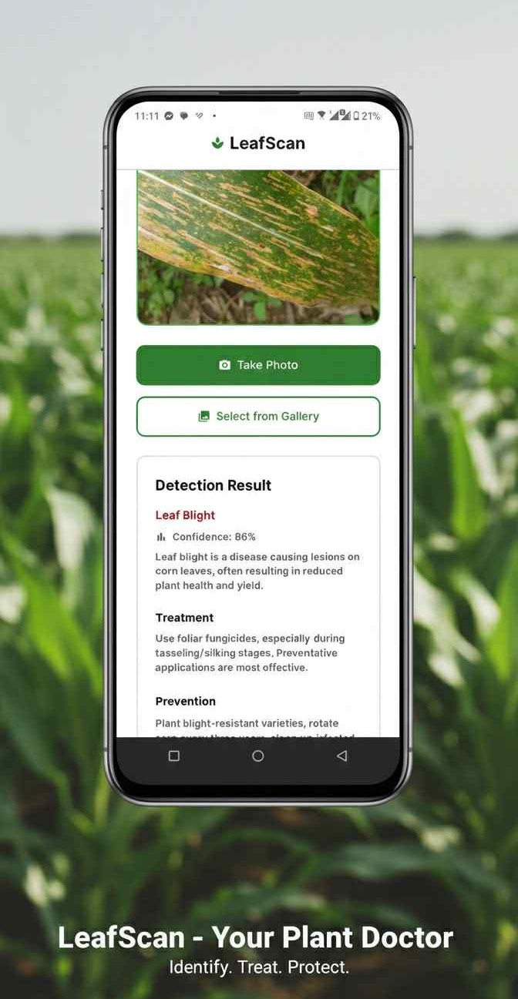

## LeafScan - Corn Leaf Disease Detection Model 

This repository integrates a deep learning model developed to classify **corn leaf diseases** commonly found in **Polomolok and General Santos City, Philippines**. The model powers the LeafScan mobile application to assist farmers in early and accurate disease identification using their smartphone cameras.

<p align="center">
  
</p>


---

### Dataset

We initially collected **1,576 raw images** of corn leaves from local farms in selected barangays. These were categorized into five classes:

* **Brown Spot**
* **Corn Rust**
* **Leaf Blight**
* **Maize Streak Virus (MSV)**
* **Healthy Leaves**

To address class imbalance and enhance generalization, we applied comprehensive **data augmentation techniques**, including:

* Rotation (±20°)
* Shifting (±15%)
* Shearing (±12°)
* Zooming (0.85–1.15 scale)
* Flipping (50% horizontal/vertical)
* Color adjustments (brightness, contrast, saturation, hue)

This process expanded the dataset to **27,146 images**, ensuring class balance (\~5,300 images per class).

---

### Model Architecture

We fine-tuned a **ResNet34** Convolutional Neural Network, pretrained on ImageNet, tailored for agricultural disease detection.

Key model details:

* Input size: **224x224 pixels**
* Fine-tuned all layers for domain-specific adaptation
* Optimizer: **AdamW**
* Scheduler: **CosineAnnealingLR**
* Regularization: **Dropout (0.4)** + **Weight Decay (0.01)**

---

### Model Performance

The model achieved a **98.67% overall accuracy** with excellent class-wise metrics:

| Class        | Precision | Recall | F1 Score |
| ------------ | --------- | ------ | -------- |
| Brown Spot   | 98.76%    | 98.97% | 99.35%   |
| Corn Rust    | 98.76%    | 99.66% | 99.21%   |
| Healthy      | 99.75%    | 96.45% | 98.07%   |
| Leaf Blight  | 99.88%    | 98.30% | 99.09%   |
| Maize Streak | 95.57%    | 99.88% | 97.68%   |

The confusion matrix showed the model correctly classified **4,162 out of 4,218 test images**, confirming robustness across categories.

---

### Mobile App Integration

The trained model is deployed via the **LeafScan app**, built with **Flutter** and integrated using **PyTorch Lite**. The app supports:

* Camera and gallery image input
* Fast inference (1–5 seconds)
* Offline functionality
* Disease description, suggested treatment, and preventive measures

[Watch 1-Minute Video Presentation](https://youtu.be/Jq-Kp7_OCLU)

---

## Getting Started (Android Only)

This Flutter application is intended to run on **Android** devices. Follow the steps below to set it up and run it locally.

### Prerequisites

Make sure you have the following installed:

* [Flutter SDK](https://flutter.dev/docs/get-started/install)
* [Android Studio](https://developer.android.com/studio) or [VS Code](https://code.visualstudio.com/) with Flutter & Dart plugins
* An Android device or emulator

### Installation Steps

```bash
# 1. Clone the repository
git clone https://github.com/PPdustin/leafscan.git
cd leafscan

# 2. Get the Flutter packages
flutter pub get

# 3. Run the app on a connected Android device or emulator
flutter run
```

### Notes

* Run `flutter doctor` to ensure your environment is correctly set up for Android development.
* If your device is not recognized, ensure USB debugging is enabled (for physical devices) or start an emulator.

---

## Credits

This application and the integrated machine learning model are based on the research conducted by:

- **Dale Anthony Agreda**, 
- **Ivan James Estores**,
- **Olsen John Gabriel Provido**,
- **Dustin Wata**

---


